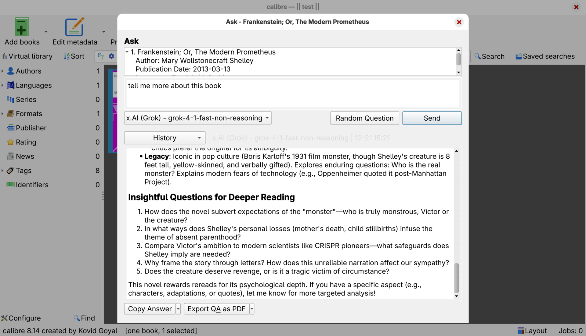

# Ask AI Plugin(old name: Ask Grok)

A simple calibre plugin that allows users to ask questions about books using various AI models including OpenAI, Anthropic Claude, Google Gemini, Grok, DeepSeek, Nvidia AI, OpenRouter, Ollama, and custom AI providers.

## Preview

## Features

- Ask questions about books directly in calibre
- Automatically includes the current book's metadata, no need to copy-paste or manually enter
- Single input-output dialog interface
- Configurable API key
- Configurable prompt template
- Automatically display the most recent query history based on a book
- Supports copying answers, copying questions and answers

## Installation

### Install from calibre Plugin Index (Recommended)

Ask AI Plugin is now available in the official calibre Plugin Index:

1. In calibre, select "Preferences" -> "Plugins" -> "Get new plugins"
2. Search for "Ask AI Plugin" in the search box
3. Select the plugin and click "Install"
4. After installation, restart calibre

### Manual Installation

Alternatively, you can download the latest version from the [releases page](https://github.com/sheldonrrr/ask_grok/releases).

Import the file to calibre custom plugins:

1. In calibre, select "Preferences" -> "Plugins" -> "Load Plugin from file"
2. Select the downloaded plugin file to install
3. After installation, restart calibre

## Supported AI Providers

- **OpenAI** - https://platform.openai.com/
- **Anthropic (Claude)** - https://console.anthropic.com/
- **Google Gemini** - https://aistudio.google.com/
- **Grok (x.AI)** - https://console.x.ai/
- **DeepSeek** - https://platform.deepseek.com/
- **Nvidia AI** - https://build.nvidia.com/ (Free tier available)
- **OpenRouter** - https://openrouter.ai/
- **Ollama** - https://ollama.ai/ (Local AI models)
- **Custom** - Any OpenAI-compatible API endpoint

### Free Nvidia API Key

Recently, Nvidia released a free API key for llama, Deepseek-r1, you can get free API key from [here](https://build.nvidia.com/).

Available models:
- meta/llama-4-maverick-17b-128e-instruct",
- meta/llama-4-scout-17b-16e-instruct
- meta/llama-3.3-70b-instruct
- deepseek-ai/deepseek-r1
- qwen/qwen2.5-coder-32b-instruct

Base URL:
`https://integrate.api.nvidia.com/v1`

API Key:
- After logging in and validating through your phone number, you can generate an API Key to use. Now the only limit is the rate limit, just limited to 40 RPM.(If you are using it for personal use, there is almost no limit.)

## Configure API Key

  - Click the Ask AI Plugin dropdown menu in the menu bar, select `Configure`
  - Select the AI provider you want to use (OpenAI, Anthropic, Gemini, Grok, DeepSeek, Nvidia, OpenRouter, Ollama, or Custom)
  - Enter the corresponding API Key into the API Key input box
  - Click the `Save` button
  - Done

## Interface Usage

1. Select a book in the calibre library
2. Click the "Ask AI Plugin" button in the toolbar
3. Enter your question in the popup dialog
4. Click "Send" to get an answer from your configured AI provider
5. Click "Random Question" to request AI-generated questions based on your selected language

## Keyboard Shortcuts

This plugin supports shortcut customization via calibre.

Customize shortcuts:
1. Open calibre
2. Go to Preferences -> Shortcuts
3. Search for "Ask AI"

Default shortcuts:
- Ask AI: Ask (global): F3
- Ask AI: Open Configuration: F2
- Ask AI: Send (in dialog): Ctrl+Enter (Cmd+Enter on macOS)
- Ask AI: Random Question (in dialog): Ctrl+R (Cmd+R on macOS)

## Language Support

Mainly maintained UI languages (new UI strings are guaranteed to be updated):
- English (en)
- German (de)
- Spanish (es)
- French (fr)
- Japanese (ja)
- Simplified Chinese (zh)
- Traditional Chinese (zht)

Legacy languages (still selectable, but new UI strings might not be updated):
- Danish (da)
- Finnish (fi)
- Dutch (nl)
- Norwegian (no)
- Portuguese (pt)
- Russian (ru)
- Swedish (sv)
- Cantonese (yue)

## Requirements

- calibre 7.25 or higher
- External Python modules:
  - requests
  - bleach
  - markdown2

### Built-in Python Modules Used

- PyQt5 (Qt GUI Framework)
  - QtWidgets: QDialog, QVBoxLayout, QHBoxLayout, QLabel, etc.
  - QtCore: Qt, QTimer
  - Qt: QKeySequence, QAction, QMenu
- Standard Library
  - os: File and path operations
  - sys: System-related parameters
  - json: JSON data processing
  - logging: Debug and error logs
  - datetime: Time operations
  - threading: Thread management

## Privacy Handling

- All AI providers' API Keys are saved as a JSON file locally after input and are not transmitted to any third-party servers
- When sending requests to AI providers, the plugin will use the book's Metadata information submitted to the selected AI provider
- The plugin's privacy handling will depend on each AI provider's own privacy policy.

## Troubleshooting

If you continue to experience `Request failed` or other issues, please delete the Ask AI Plugin and related configuration files and then re-install the latest version of the plugin.

Delete Ask AI Plugin and related configuration files:
- calibre Preference
- Miscellaneous
- Open calibre Configuration Folder(Button)
- Plugins(Open this folder)
- Delete all things with `ask_ai_plugin` as prefix
- Install Plugin's Latest Version
- Restart calibre

About Ask AI Plugin Configuration Files:
- Ask AI Plugin.zip/Ask AI Plugin folder: Plugin folder, delete it to remove the plugin
- ask_ai_plugin.json: Plugin configuration file, delete it to remove the plugin's configuration information
- ask_ai_plugin_logs folder: Plugin log folder, delete it to remove the plugin's log information
- ask_ai_plugin_latest_history.json: Plugin recent query history file, delete it to remove the plugin's recent query history information

Note!
- When providing feedback, please do not provide your AI provider's API Key, please keep it confidential, once leaked, your AI provider's API Key may be abused.