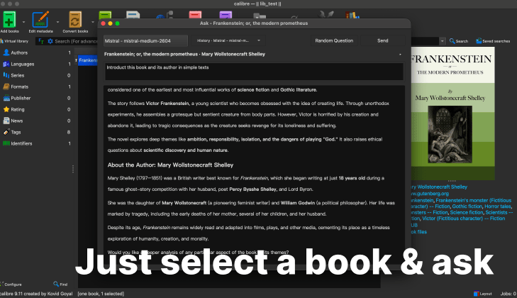

# Ask AI Plugin(old name: Ask Grok)

A calibre plugin for asking questions about books in your library. It works immediately after install with **Nvidia AI (Free)** (no API key). You can also add OpenAI, Anthropic Claude, Google Gemini, Grok (SpaceXAI), DeepSeek, Kimi (Moonshot), Mistral, Nvidia AI with your own key, Perplexity (Sonar), OpenRouter, Ollama, LM Studio, KoboldCpp, or a custom OpenAI-compatible provider.

## Preview

## Features

- Ask about one book or several selected books, without copy-pasting metadata
- Works out of the box with Nvidia AI (Free); add your own providers when you want
- Search your library in natural language (AI Search)
- Random questions, prompt templates, and recent history per book
- Copy answers, or copy the question and answer together

## Installation

### Install from calibre Plugin Index (Recommended)

Ask AI Plugin is now available in the official calibre Plugin Index:

1. In calibre, select "Preferences" -> "Plugins" -> "Get new plugins"
2. Search for "Ask AI Plugin" in the search box
3. Select the plugin and click "Install"
4. After installation, restart calibre

### Manual Installation

Alternatively, you can download the latest version from the [releases page](https://github.com/sheldonrrr/ask_grok/releases).

Import the file to calibre custom plugins:

1. In calibre, select "Preferences" -> "Plugins" -> "Load Plugin from file"
2. Select the downloaded plugin file to install
3. After installation, restart calibre

## Supported AI Providers

- **OpenAI** - https://platform.openai.com/
- **Anthropic (Claude)** - https://console.anthropic.com/
- **Google Gemini** - https://aistudio.google.com/
- **Grok (SpaceXAI)** - https://console.x.ai/
- **DeepSeek** - https://platform.deepseek.com/
- **Kimi (Moonshot)** - https://platform.kimi.ai/ (China: https://platform.moonshot.cn/)
- **Mistral** - https://console.mistral.ai/
- **Nvidia AI (Free)** - Default after install. No API key. Maintained by the plugin developer for people who cannot configure their own AI. It can be less stable than using your own key.
- **Nvidia AI** - https://build.nvidia.com/ — your own Nvidia key (new accounts usually get free credits)
- **Perplexity (Sonar)** - https://docs.perplexity.ai/ (research-style answers with citations)
- **OpenRouter** - https://openrouter.ai/
- **Ollama** - https://ollama.com/ (local, OpenAI-compatible `/v1`)
- **LM Studio** - https://lmstudio.ai/ (local, OpenAI-compatible `/v1`)
- **KoboldCpp** - https://github.com/LostRuins/koboldcpp (local, OpenAI-compatible `/v1`)
- **Custom (OpenAI Compatible)** - Any OpenAI Chat Completions–compatible API (`/chat/completions`)

When Perplexity returns citations, the plugin appends a plain-text reference list with full URLs.

### Nvidia AI (Free) vs your own Nvidia key

These are two different providers in the plugin. Do not mix them up.

**Nvidia AI (Free)** is the default. You can ask questions as soon as the plugin is installed. No signup and no API key. It is a shared channel the developer keeps available so less technical users, or people still exploring, can try basic questions. It may be slower or unavailable at busy times. If you care about sending questions only to an account you control, use your own Nvidia key or a local provider instead.

Default model: `nvidia/nemotron-3.5-lightning-30b-a3b` (you can change it in Configuration).

**Nvidia AI** (your own key) talks to Nvidia directly with a key you create at [build.nvidia.com](https://build.nvidia.com/). New accounts usually get free credits after phone verification; no credit card is required. This is more stable for regular use.

- Default model: `nvidia/nemotron-3-nano-30b-a3b`
- Official API base: `https://integrate.api.nvidia.com/v1`
- Personal use is usually limited by Nvidia’s rate limit (often around 40 requests per minute)

Other Nvidia models can be chosen in Configuration after you load the model list.

## Configure an AI (optional)

Nvidia AI (Free) needs no configuration. To add another provider:

1. Open the Ask AI Plugin menu and choose **Configure**
2. Click **Add AI**, pick a provider, and enter an API key if that provider needs one
3. Load and select a model, then save
4. Optionally set it as the default AI

Local providers (Ollama, LM Studio, KoboldCpp) usually do not need a key.

## Interface Usage

1. Select a book in the calibre library
2. Click the "Ask AI Plugin" button in the toolbar
3. Enter your question in the popup dialog
4. Click "Send" to get an answer (Nvidia AI (Free) is used until you pick another default)
5. Click "Random Question" to request AI-generated questions in your selected language

## Keyboard Shortcuts

This plugin supports shortcut customization via calibre.

Customize shortcuts:
1. Open calibre
2. Go to Preferences -> Shortcuts
3. Search for "Ask AI"

Default shortcuts:
- Ask AI: Ask (global): Ctrl+L
- Ask AI: Open Configuration: F2
- Ask AI: Send (in dialog): Ctrl+Enter (Cmd+Enter on macOS)
- Ask AI: Random Question (in dialog): Ctrl+Shift+R (Cmd+Shift+R on macOS)

## Language Support

Mainly maintained UI languages (new UI strings are guaranteed to be updated):
- English (en)
- German (de)
- Spanish (es)
- French (fr)
- Japanese (ja)
- Simplified Chinese (zh)
- Traditional Chinese (zht)

Also available (may lag slightly on brand-new UI strings):
- Danish (da)
- Finnish (fi)
- Dutch (nl)
- Norwegian (no)
- Portuguese (pt)
- Russian (ru)
- Swedish (sv)
- Cantonese (yue)

## Requirements

- calibre 6.0 or higher
- No extra Python packages to install; runtime libraries ship inside the plugin

## Privacy Handling

- API keys you enter are stored in calibre’s local plugin settings. They are not sent to the plugin author.
- Your question and the selected book’s metadata are sent to the AI provider you are using.
- **Nvidia AI (Free)** uses a developer-maintained channel, then Nvidia. The developer does not sell user data. Nvidia may still apply its own free-tier policies. If you prefer not to use that channel, add your own Nvidia key or use a local provider such as Ollama.
- Other providers follow their own privacy policies.

## Troubleshooting

If you continue to experience `Request failed` or other issues, please delete the Ask AI Plugin and related configuration files and then re-install the latest version of the plugin.

Delete Ask AI Plugin and related configuration files:
- calibre Preference
- Miscellaneous
- Open calibre Configuration Folder(Button)
- Plugins(Open this folder)
- Delete all things with `ask_ai_plugin` as prefix
- Install Plugin's Latest Version
- Restart calibre

About Ask AI Plugin Configuration Files:
- Ask AI Plugin.zip/Ask AI Plugin folder: Plugin folder, delete it to remove the plugin
- ask_ai_plugin.json: Plugin configuration file, delete it to remove the plugin's configuration information
- ask_ai_plugin_latest_history.json: Plugin recent query history file, delete it to remove the plugin's recent query history information

Note!
- When providing feedback, please do not provide your AI provider's API Key, please keep it confidential, once leaked, your AI provider's API Key may be abused.